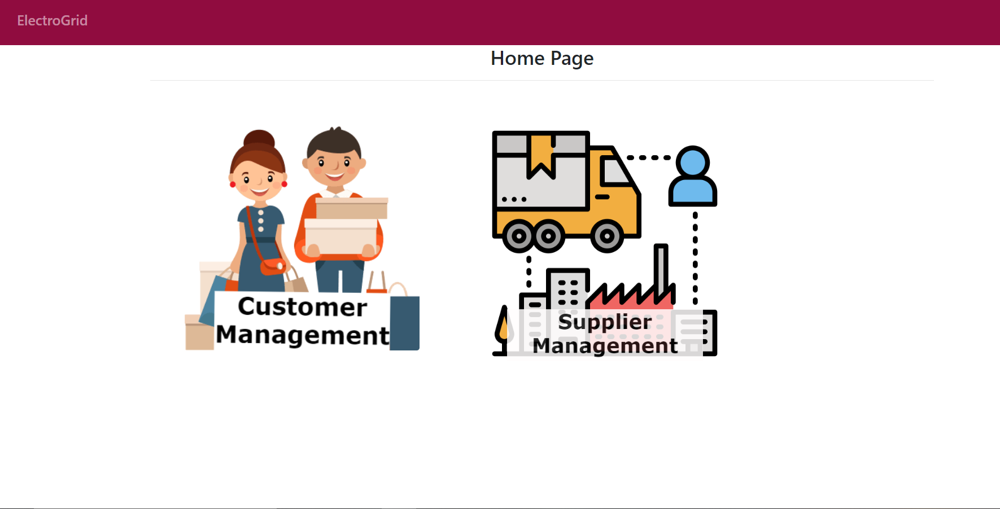
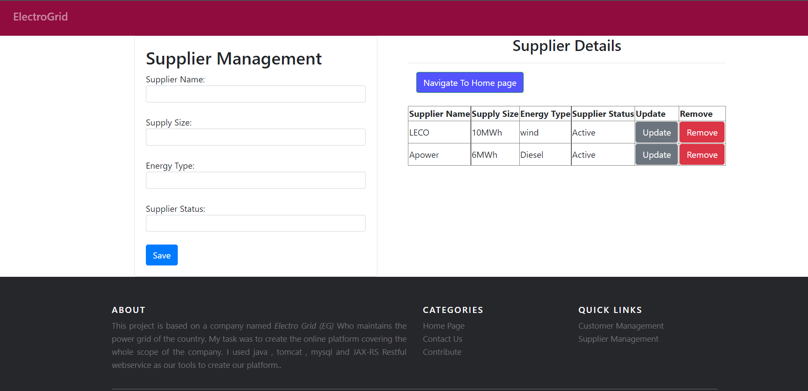

# ElectroGrid-ClientSide

# About Project
This project is based on a company named Electro Grid (EG) Who maintains the power grid of the country. I have developed 2 functions in this system and they are Customer function, Supplier function.

# Technologies Used
-  java JAX-RS(jersy) Restful web service  
-  Apache  Tomcat  
-  mysql as the database 
-  eclipse IDE.

# How to execute the project?
Import the DB then clone the project and after it become cloned by using apache tomcat server the project can be execute. Execute the Index.jsp file through apache tomcat. After execution you can see the Index.jsp in your browser.

#  Link  To ElectroGrid-ClientSide Database
https://github.com/SubhashanaSS/ElectroGrid-ClientSide/blob/master/Database/electrogrid_clientside.sql

# Screenshot of the UI

<h1>Homepage</h1>

<h1>Customer Management</h1>

<h1>Supplier Management</h1>

